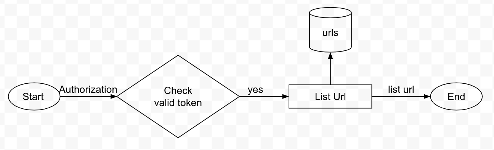

### Overview
This is a service which named [URL-shortener] for a shorten link, this service base-on clean architecture, right now this service can handle login/redirect/create/list/search/delete functions.
To make it run:
- `go run main.go`
- Import Postman collection from `doc` to check example

### Structure of project


### List API
- Login
- Redirect
- Create
- List
- Search
- Delete

### Login function

- This function used to admin need to login in order to access some functions like list, search, delete url.

### Redirect function

- User just needs to access the link `localhost:8080/[short_code]` with the short code you need to input.
- The system will get information about url in the database via short code.
- Checking expiry of full url with the current time.
- Update the number of hits when accessing the link valid.
- Redirecting to full url.

### Create function

- User has to input params with full url and expiry.
- The system will check null and valid format with full url.
- Escape with a special character.
- Add a new url in the database.

### List function

- This function just only admin use via use token when you login into the system.
- The system gets all the information about urls in the database.

### Search function

- This function just only admin use via use token when you login into the system.
- The system gets the information by input params like short code, full url.

### Delete function

- This function just only admin use via use token when you login into the system.
- The system gets the information of url by input params like short code from the database.
- The system will check null it.
- Delete url by short code in the database.

### DB Schema
```sql
-- users definition

CREATE TABLE users (
	user_id TEXT NOT NULL,
	password TEXT NOT NULL
);

INSERT INTO users (user_id, password) VALUES('admin', 'admin');

-- urls definition

CREATE TABLE urls (
	id INTEGER PRIMARY KEY,
	short_code TEXT NOT NULL,
	full_url TEXT NOT NULL,
	created_date INTEGER,
	expiry INTEGER,
	number_of_hits INTEGER
);
```